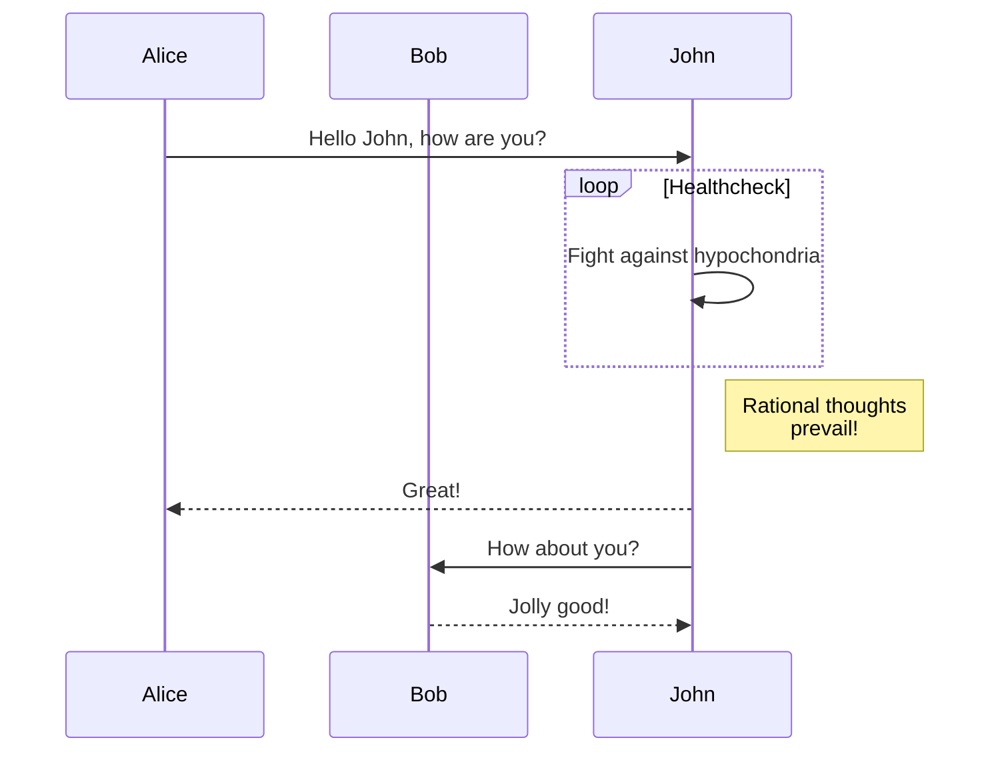
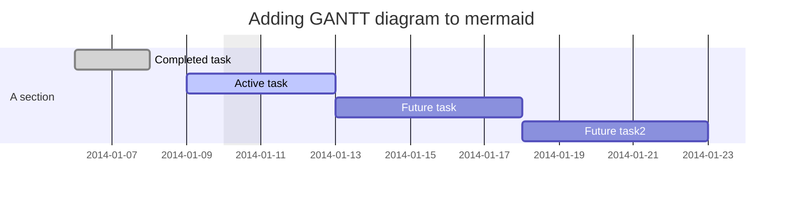
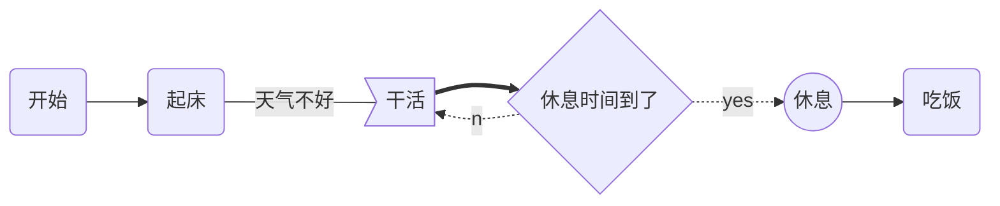
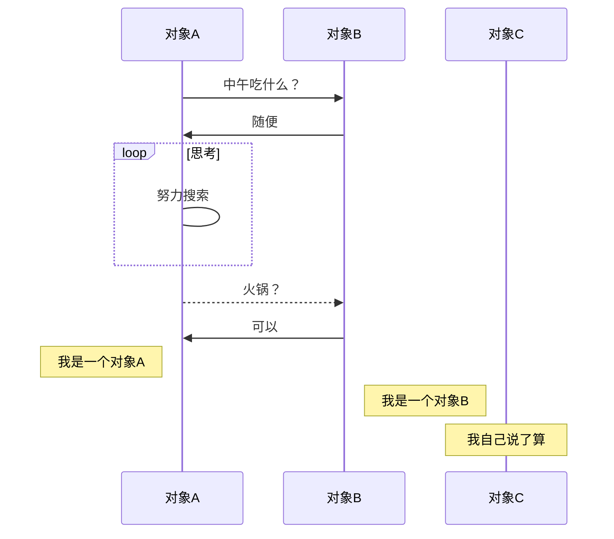
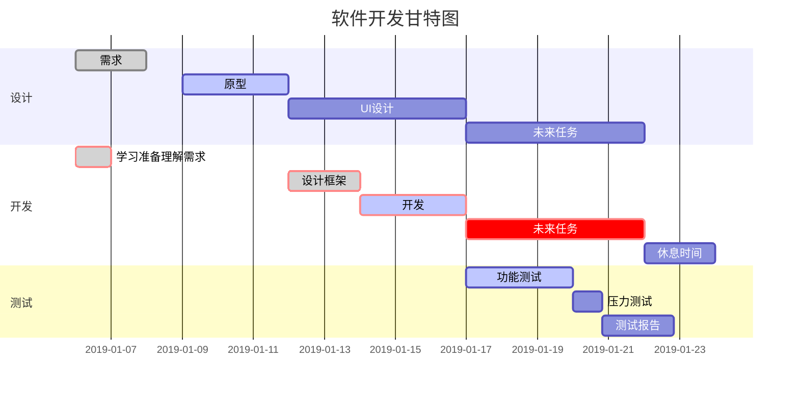

<!-- more -->

Mongoose 是基于 nodejs，使用 javascript 编程，连接 mongodb 数据库的软件包，使 mongodb 的文档数据模型变的优雅起来，方便对 mongodb 文档型数据库的连接和增删改查等常规数据操作。

mongoose 是当前使用 mean（mongodb express angularjs nodejs）全栈开发必用的连接数据库软件包。

参考资料：

[在线数据库](https://mlab.com/)

[mongoose guide](http://www.mongoosejs.net/docs/guide.html)

## 后台与数据库交互

- 使用数据库的原生语言（例如 SQL）
- 使用对象数据模型（Object Data Model，简称 ODM）或对象关系模型（Object Relational Model，简称 ORM）。 ODM / ORM 能将网站中的数据表示为 JavaScript 对象，然后将它们映射到底层数据库。一些 ORM 只适用某些特定数据库，还有一些是普遍适用的。

使用 SQL 或其它受到支持的查询语言才能达到最佳性能。

ODM 通常慢一些，因为在对象和数据库格式之间存在一层用于映射的翻译代码，使它不一定会选用最高性能的数据库查询（尤其是普遍使用级别的 ODM，它必须在各类数据库功能方面做出更大的折衷）。

使用 ORM 的好处是：程序员可以继续用 JavaScript 对象的思维而不用转向数据库语义的思维。 在（同一个或不同网站）使用不同数据库时尤为明显。使用 ORM 还可以更方便地对数据进行验证和检查。

## Mongoose

- Mongoose 是在 node.js 异步环境下对 mongodb 进行便捷操作的对象模型工具

Mongoose 的优点：

- 可以为文档创建一个模式结构（Schema）
- 可以对模型中的对象/文档进行验证
- 数据可以通过类型转换为对象模型
- 可以使用中间件来应用业务逻辑挂钩
- 比 Node 原生的 MongoDB 驱动更容易
  Mongoose 是最受欢迎的 ODM，选用 MongoDB 数据库时，它是一个合理的选择。

新的对象：

- Schema（模式对象）
  — Schema 对象定义约束了数据库中的文档结构
- Model
  — Model 对象作为集合中的所有文件的表示，相当于 MondoDB 数据库中的集合 collection
- Document
  — Document 表示集合中的具体文档，相当于集合中的一个具体的文档

### mongoose 连接数据库

```js
// 1.下载 npm init -y & npm i mongoose -S

// 2.引入 mongoose
const mongoose = require('mongoose');

// 4.监听mongoDB数据库的连接状态
mongoose.connection.once('open', () => {
  console.log('成功连接到 mongoDB 数据库');
});
mongoose.connection.once('close', () => {
  console.log('断开 mongoDB 数据库');
});

// 3.连接数据库
// mongoose.connect('mongodb://数据库ip地址:端口号(默认：27017)/数据库名')
mongoose.connect(
  'mongodb://127.0.0.1/test',
  {
    useNewUrlParser: true,
    useUnifiedTopology: true
  },
  (err, db) => {
    console.log('连接数据库成功');
  }
);

// mongoose 断开连接
// mongoose.disconnect()

// 定义一个schema
const Schema = mongoose.Schema;

// model模型
const stuSchema = new Schema({
  name: String,
  age: Number,
  gender: {
    type: String,
    default: 'female'
  },
  address: String
});

// 创建一个 model -> collection # mogoose.model(modelName, schema)
const StuModel = mongoose.model('stus', stuSchema);

// 测试：创建一个文档插入到数据库中
// StuModel.create({
//   name: 'houfei',
//   age: 25,
//   gender: 'male',
//   address: '河北'
// }, err => {
//   if(!err) console.log('插入成功')
//   else console.log('插入失败')
// })
```

### Model 的 API

**document 是 model 的实例**

#### 插入

```js
// StuModel.create(object1, object2, ..., (err, object1, object2, ...) = > { })
// StuModel.create(array, (err, array) = > { })
StuModel.create(
  [
    {
      name: 'liming',
      age: 23,
      gender: 'male',
      address: '安徽'
    }
  ],
  (err, array) => {
    console.log(array);
    if (!err) console.log('插入成功');
    else console.log('插入失败');
  }
);
```

#### 查询数据

```js
/**
 * filter 查询条件
 * projection 投影
 * options 查询选项 skip limit
 * callback 回调函数
  Model.find(filter, [projection], [options], [callback])
  Model.findById()
  Model.findByIdAndDelete()
  Model.findByIdAndRemove()
  Model.findByIdAndUpdate()
  Model.findOne()
  Model.findOneAndDelete()
  Model.findOneAndRemove()
  Model.findOneAndReplace()
  Model.findOneAndUpdate()
*/
```

```js
// 在 StuModel 查询 name 为 jack，并且 age 大于 22的所有array文档，并且只显示 name age 属性，不显示 _id 属性， array并且要跳过 skip 第一条数据
StuModel.find({ name: 'jack', age: { $gte: 22 } }, 'name age -_id', { skip: 1 }, (err, docs) => {
  console.log(docs);
  if (!err) console.log('查询成功');
  else console.log('查询失败');
});
```

```js
StuModel.findOne({ age: { $gte: 19 } }, 'name age -_id', {}, (err, doc) => {
  console.log(doc);
  if (!err) console.log('查询成功');
  else console.log('查询失败');
});
```

```js
StuModel.findById('5ee9f47cf67607ea5eda6894', 'name', {}, (err, doc) => {
  console.log(doc instanceof StuModel);
  if (!err) console.log('查询成功');
  else console.log('查询失败');
});
```

#### 更新数据

```js
/*
Model.updateMany(filter, doc, [options], [callback])
Model.updateOne(filter, doc, [options], [callback])
Model.replaceOne(filter, doc, [options], [callback])
*/

StuModel.updateOne(
  { name: 'houfei' },
  {
    $set: {
      age: 1
    }
  },
  { multi: false },
  (err, status) => {
    console.log(status);
    if (!err) console.log('修改成功');
    else console.log('修改失败');
  }
);
```

#### 删除数据

```js
/*
Model.deleteMany(conditions, [options], [callback])
Model.deleteOne(conditions, [options], [callback])
*/

StuModel.deleteOne({ name: 'houfei' }, (err, state) => {
  console.log(state);
  if (!err) console.log('删除成功');
  else console.log('删除失败');
});
```

### Document 的 API

```js
// 创建 Document 对象
let stu = new StuModel({
  name: '李白',
  age: 30,
  gender: 'female',
  address: '四川'
});
```

#### [doc.save()](https://mongoosejs.com/docs/api/document.html#document_Document-save)

```js
// 保存方法 save
stu.save((err, state) => {
  console.log(state);
  if (!err) console.log('添加成功');
  else console.log('添加失败');
});
```

#### [doc.update()](https://mongoosejs.com/docs/api/document.html#document_Document-update)

```js
StuModel.findOne({}, (error, doc) => {
  /**
   * Document.prototype.update(doc, options, callback)
   * doc «Object»
   * options «Object»
   * callback «Function»
   */
  doc.update(
    {
      $set: {
        age: 1
      }
    },
    (err, status) => {
      console.log(status);
      if (!err) console.log('修改成功');
      else console.log('修改失败');
    }
  );
});
```

#### [doc.get()|.set()|id](https://mongoosejs.com/docs/api/document.html#document_Document-get)

```js
StuModel.findOne({}, (error, doc) => {
  console.log(doc.id);
  doc.get('address', String);
  doc.set('age', 99);
});
```

#### [doc.toJSON()|toObject](https://mongoosejs.com/docs/api/document.html#document_Document-toJSON)

```js
StuModel.findOne({}, (error, doc) => {
  let a = doc.toJSON();
  let b = doc.toObject();
  console.log(a, b);
});
```

### Mongoose 模块化

[ 视频地址](https://www.bilibili.com/video/BV1Lb411V7rv?p=19)

### 拓展甘特图

[GitHub guide](https://mermaid-js.github.io/mermaid/#/README)

#### [流程图](https://mermaid-js.github.io/mermaid/#/README?id=flowchart)


#### [顺序图](https://mermaid-js.github.io/mermaid/#/README?id=sequence-diagram)



#### [甘特图](https://mermaid-js.github.io/mermaid/#/README?id=gantt-diagram)



#### 其他一



#### 其他二



#### 其他三


