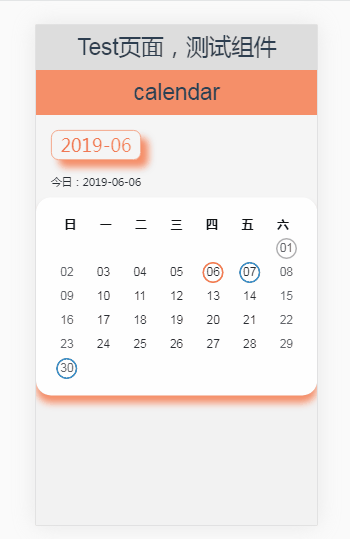
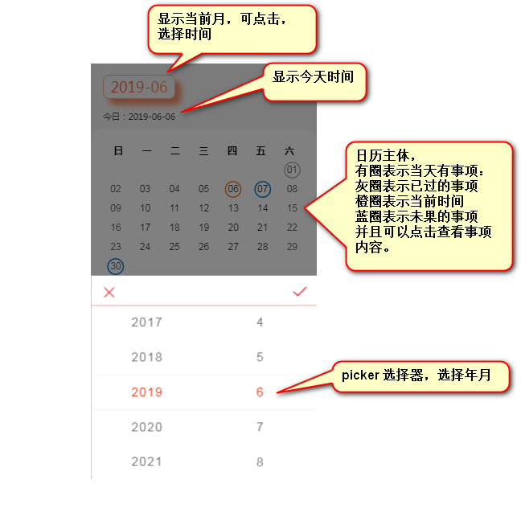
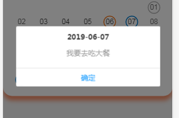
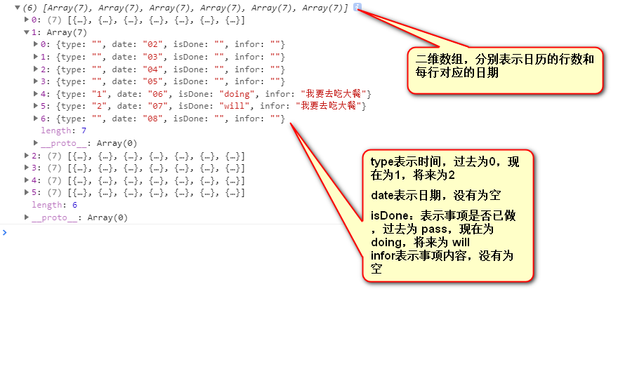

<!-- more -->

# 日历组件

## 效果

> 忙活了大概三天，做出来非常开心，心里美滋滋的
>
> 其实很早就想自己写一个日历组件了，只怪自己懒散
>
> 现在写一下思路过程，记录一下



## 需求

1、实现一个日历组件，如图：



2、显示某天的事项：



3、事项是模拟父组件请求接口返回的，数据格式如下：

```js
[
  {
    id: '232',
    date: '2019-06-01',
    info: '我要去吃大餐'
  },
  {
    id: '292',
    date: '2019-06-06',
    info: '我要去吃大餐'
  },
  {
    id: '292',
    date: '2019-06-07',
    info: '我要去吃大餐'
  },
  {
    id: '369',
    date: '2019-06-30',
    info: '我要去吃大餐'
  }
];
```

4、把事项添加到日历组件中，数据格式如下：



## 代码解析

**package.json 文件：**

父组件页面：

```html
<template>
  <div class="test-container">
    <h1>Test页面，测试组件</h1>
    <!-- 日历 -->
    <calendar v-if="calendarVisible" @getDateInfo="getDateInfo" :propsInfoList="propsInfoList" :propsTime="propsTime"></calendar>
  </div>
</template>

<script>
  import calendar from '@/components/Calendar/Calendar.vue';
  export default {
    name: 'test',
    components: {
      calendar: calendar
    },
    data() {
      return {
        calendarVisible: true,
        propsTime: '',
        propsInfoList: '',
        middle: [
          {
            id: '232',
            date: '2019-06-01',
            info: '我要去吃大餐'
          },
          {
            id: '292',
            date: '2019-06-06',
            info: '我要去吃大餐'
          },
          {
            id: '292',
            date: '2019-06-07',
            info: '我要去吃大餐'
          },
          {
            id: '369',
            date: '2019-06-30',
            info: '我要去吃大餐'
          }
        ]
      };
    },
    created() {
      // 模拟首屏ajax请求，将当月数据传入组件中
      this.propsInfoList = JSON.stringify(this.middle);
      this.propsTime = this.getToday();
    },
    mounted() {
      window.alert('测试时间为19年 5、6、7月，完成是在6月');
    },
    methods: {
      // 格式化当前日期 YYYY-MM-DD
      getToday() {
        let nowDate = new Date();
        let yy = nowDate.getFullYear().toString();
        let mm = (nowDate.getMonth() + 1 + '').padStart(2, '0');
        let dd = (nowDate.getDate() + '').padStart(2, '0');
        // let hh = nowDate.getHours().toString().padStart(2,'0')
        // let mt = (nowDate.getMinutes() + '').padStart(2,'0')
        // let ss = (nowDate.getSeconds() + '').padStart(2,'0')
        return `${yy}-${mm}-${dd}`; // -${hh}-${mt}-${ss}
      },
      // 组件传值
      getDateInfo(year, month) {
        let _this = this;
        _this.propsTime = `${year}-${month}`;
        _this.calendarVisible = false;
        // 模拟点击选取其他年月的ajax，假数据，只能显示19年 5 6 7三个月
        setTimeout(() => {
          _this.propsInfoList = [];
          let middle;
          if (month == '05') {
            middle = [
              {
                id: '232',
                date: '2019-05-10',
                info: '我要去吃小餐'
              }
            ];
          } else if (month == '06') {
            middle = _this.middle;
          } else if (month == '07') {
            middle = [
              {
                id: '232',
                date: '2019-07-10',
                info: '我要去吃小餐'
              }
            ];
          } else {
            middle = '';
          }
          _this.propsInfoList = JSON.stringify(middle);
          _this.calendarVisible = true;
        }, 100);
      }
    }
  };
</script>
```

日历子组件：

```html
<template>
  <div class="calendar-container">
    // 日历标题
    <h1>calendar</h1>
    // 显示本月日期 2019-6，可点击
    <div class="show-date" @click="clickData">{{showDate}}</div>
    // 今天的日期 2019-6-6
    <div class="now-time">今日：{{exactTime}}</div>
    // 日历组件
    <div class="calendar">
      // 日历组件头部
      <ul class="calendar-header">
        <li>日</li>
        <li>一</li>
        <li>二</li>
        <li>三</li>
        <li>四</li>
        <li>五</li>
        <li>六</li>
      </ul>
      // 日历组件主体
      <ul class="calendar-body">
        <li class="calendar-row" v-for="(item, index) in JSON.parse(calendarData)" :key="index">
          // 注意给 不同的日子加类名 // 周末：weekend 工作日：weekday // 过去的事项 already-time 今天的事项 exact-time 将来的事项 soon-time // 给有事项的日子实现点击弹框，显示这天的事项内容
          <span v-for="(subItem, subIndex) in item" :class="[subIndex == 0 || subIndex == 6? 'weekend': 'weekday', subItem.type == '1'? 'exact-time': '', subItem.type == '0'? 'already-time': '', subItem.type == '2'? 'soon-time': '']" @click="showInfo(subItem)" :key="subIndex">{{subItem.date}}</span>
        </li>
      </ul>
    </div>
    // popup 和 picker 搭配，实现 年月 选择 mint-ui 库
    <mt-popup v-model="popupVisible" position="bottom">
      <mt-picker :slots="slots" :showToolbar="true" :visibleItemCount="5" :itemHeight="itemsHeight" ref="picker">
        
        
      </mt-picker>
    </mt-popup>
  </div>
</template>
```

日历子组件逻辑：

```js
import { MessageBox } from 'mint-ui';
export default {
  name: 'calendar',
  props: {
    propsTime: String,
    propsInfoList: String
  },
  data() {
    return {
      // 接收父组件传值 '2019-06'
      time: '',
      // 接收父组件数据列表
      infoList: '',
      // 日历组件
      calendarData: [],
      // 页面展示的 '年-月'
      showDate: '',
      // 当前的 '年-月-日'
      exactTime: '',
      // picker 高度
      itemsHeight: (95 * window.screen.height) / 1334,
      // pupop 显示
      popupVisible: false,
      // picker 数据
      slots: []
    };
  },
  created() {
    // 拿到父组件的 list
    this.infoList = this.propsInfoList;
    // 拿到父组件的 '2019-06'
    this.time = this.propsTime.split('-');
    // 获取今天 '2019-06-06'
    const date = this.getToday();
    this.exactTime = date.slice(0, 3).join('-');
    // 日历组件
    this.getCalendar(...this.time);
    // 组装 picker 数组
    this.getSlotsArray(...date.slice(0, 2));
  },
  methods: {
    // 日历组件
    getCalendar(year, month) {
      let _this = this;
      // 转存当天 '2019-06-06'
      const rightNow = _this.exactTime;
      // 拼接 显示日历上的年月 '2019-05'
      _this.showDate = `${year}-${month}`;
      // 获取当月的第一天
      const firstDate = new Date(year, month - 1, 1);
      // 获取第一天周几
      const firstDay = firstDate.getDay();
      // 判断是否为闰年
      const isLeapYear = year % 100 == 0 ? (year % 400 == 0 ? 1 : 0) : year % 4 == 0 ? 1 : 0;
      // 获取今年每个月的天数
      const monthArray = [31, 28 + isLeapYear, 31, 30, 31, 30, 31, 31, 30, 31, 30, 31];
      // 计算星期的行数
      const weeekLines = Math.ceil((monthArray[month - 1] + firstDay) / 7);
      let calendar = [];
      for (let i = 0; i < weeekLines; i++) {
        let weeekLinesInfo = [];
        for (let j = 0; j < 7; j++) {
          // 计算每个单元格的序号
          const cellNo = i * 7 + j;
          // 计算每个单元格应该填充的日期
          const datePerLine = cellNo - firstDay + 1;
          // 排除空白格
          if (datePerLine <= 0 || datePerLine > monthArray[month - 1]) {
            // 不存在的显示为 null 和 ''
            let outOfMonth = {
              type: 'null',
              date: ''
            };
            weeekLinesInfo[j] = outOfMonth;
          } else {
            let day = (datePerLine + '').padStart(2, '0');
            let inOfMonth = {
              type: '',
              date: day,
              isDone: '',
              infor: ''
            };
            // 今天背景变成一个红圈,这是今天 => rightNow
            const propsDate = `${year}-${month}-${day}`;
            // 比较每月的今天
            if (propsDate == rightNow) {
              inOfMonth.type = '1';
            }
            const reservations = JSON.parse(_this.infoList);
            // 将 父组件传的 list 赋值在日历上
            // 预定列表 和 当月每一天比较
            for (let k = 0; k < reservations.length; k++) {
              if (propsDate == reservations[k].date) {
                // inOfMonth.type = "1"
                inOfMonth.infor = reservations[k].info;
                if (rightNow == reservations[k].date) {
                  inOfMonth.type = '1';
                  inOfMonth.isDone = 'doing';
                } else if (rightNow > reservations[k].date) {
                  inOfMonth.type = '0';
                  inOfMonth.isDone = 'pass';
                } else if (rightNow < reservations[k].date) {
                  inOfMonth.type = '2';
                  inOfMonth.isDone = 'will';
                }
              }
            }
            weeekLinesInfo[j] = inOfMonth;
          }
        }
        calendar.push(weeekLinesInfo);
      }
      window.console.log(calendar);
      // 即将遍历二维数组
      _this.calendarData = JSON.stringify(calendar);
    },
    // 格式化当前日期 YYYY-MM-DD
    getToday() {
      let nowDate = new Date();
      let yy = nowDate.getFullYear().toString();
      let mm = (nowDate.getMonth() + 1 + '').padStart(2, '0');
      let dd = (nowDate.getDate() + '').padStart(2, '0');
      let hh = nowDate.getHours().toString().padStart(2, '0');
      let mt = (nowDate.getMinutes() + '').padStart(2, '0');
      let ss = (nowDate.getSeconds() + '').padStart(2, '0');
      return [yy, mm, dd, hh, mt, ss];
      // return `${yy}-${mm}-${dd}-${hh}-${mt}-${ss}`
    },
    // 组装 picker 数组
    getSlotsArray(year, month) {
      let _this = this;
      let yearArray = [];
      for (let i = -10; i <= 10; i++) {
        yearArray.push(year - 1 + i);
      }
      let monthArray = [1, 2, 3, 4, 5, 6, 7, 8, 9, 10, 11, 12];
      let slots = [
        {
          values: yearArray,
          className: 'slot1',
          defaultIndex: 11
        },
        {
          values: monthArray,
          className: 'slot2',
          defaultIndex: month - 1
        }
      ];
      _this.slots = slots;
    },
    // 显示日期弹窗
    clickData() {
      this.popupVisible = true;
    },
    // 取消按钮
    cancelFunc() {
      this.popupVisible = false;
    },
    // 确认按钮
    sureFunc() {
      let _this = this;
      _this.popupVisible = false;
      const clickData = _this.$refs.picker.getValues();
      const year = clickData[0] + '';
      const month = (clickData[1] + '').padStart(2, '0');
      const day = _this.time[2];
      _this.getDateInfo(year, month);
      _this.getCalendar(year, month);
    },
    // 调用父组件定义的方法
    getDateInfo(year, month) {
      this.$emit('getDateInfo', year, month);
    },
    // 点击展示某天的事项信息
    showInfo(info) {
      let _this = this;
      const infor = info;
      if (infor.infor) {
        const [year, month] = _this.showDate.split('-');
        console.log(year, month, info);
        const titleDate = `${year}-${month}-${info.date}`;
        const preview = info.infor;
        MessageBox({
          title: titleDate,
          message: preview,
          showCancelButton: false,
          closeOnClickModal: true
        });
      }
    }
  }
};
```

其他：为了减少篇幅，省略样式

[github 地址](https://github.com/houfeii)
